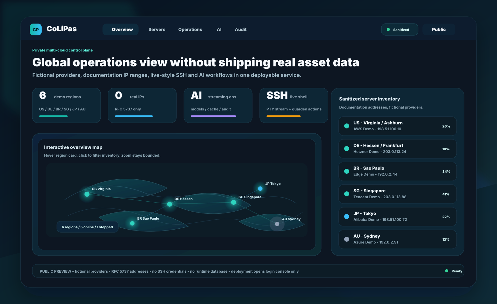

<div align="center">


<p align="center">
  <a href="https://github.com/nmklio/CoLiPas/actions/workflows/ci.yml"></a>
  
  
  
  
</p>

<h3>Production-grade multi-cloud operations in one deployable Node service.</h3>

<p>
  <b>CoLiPas</b> brings server inventory, global monitoring, SSH access, AI operations, workflow automation,
  custom API testing, and security audit into one private control panel.
</p>

<p align="center">
  <a href="#quick-start">Quick start</a>
  &nbsp;|&nbsp;
  <a href="#production-deploy">Production deploy</a>
  &nbsp;|&nbsp;
  <a href="#security-model">Security model</a>
  &nbsp;|&nbsp;
  <a href="#project-layout">Project layout</a>
</p>



<sub>The preview image uses fictional providers and RFC 5737 documentation IP ranges only. It does not contain user servers, real IP addresses, SSH credentials, or runtime data.</sub>

</div>

## Languages

[中文文档](README_CN.md) | [English Docs](README.md) | [日本語ドキュメント](README_JP.md)

## Product Snapshot

CoLiPas is a self-hosted cloud operations console for teams that need one private place to manage servers, SSH access, AI-assisted operations, custom API checks, and release security evidence. It is built as a single deployable Node.js service: Express serves the protected API and production React frontend, while SQLite stores account settings, server inventory, audit trails, AI provider settings, and encrypted SSH metadata.

The project is designed for practical production use rather than a demo-only dashboard: it includes guarded SSH password/private-key access, an xterm-style browser terminal, operation preflight checks, AI streaming with cached context, SSRF-resistant custom API testing, security remediation workflows, Docker deployment, native Linux/systemd deployment, and reset tooling for forgotten admin passwords.

## Why It Feels Different

| Release-ready area | CoLiPas approach |
| --- | --- |
| Clean public distribution | Repository assets use sanitized demo data only; runtime `.data`, `.env`, screenshots, and local databases are ignored. |
| Real operations workflow | Server onboarding, map filtering, SSH shell, AI chat, orchestration, custom API testing, and audit remediation are linked. |
| Safer defaults | Protected APIs require login, sensitive AI/API/SSH data is redacted, and test fixtures use documentation IP ranges. |

## What CoLiPas Does

CoLiPas is designed for teams that manage a mix of public cloud, private cloud, overseas nodes, and manually onboarded Linux servers. The frontend is a React operations console; the backend is an Express API that serves the app, protects operator sessions, stores state in SQLite, and performs guarded integrations.

| Area | What is included |
| --- | --- |
| Multi-cloud inventory | Cloud account overview, custom provider names, server lifecycle status, region and OS detection, resource refresh, and dashboard map grouping. |
| Server access | Manual onboarding, inventory-only mode, simulated SSH mode, real password/private-key SSH verification, live shell streaming, diagnostics, and guarded power actions. |
| AI operations | OpenAI-compatible base URL support, model discovery, streaming chat, multi-turn context, cache reuse, force refresh, and connectivity testing. |
| Workflow automation | Targeted operation tasks for asset sync, health checks, patching, backup verification, and SSH-connected server workflows. |
| Custom API lab | Allowlisted backend proxy for testing provider APIs without exposing browser-side secrets or private network targets. |
| Security audit | Auth events, blocked API calls, SSH actions, remediation flows, risk relation cards, and audit trail persistence. |
| Operator experience | Login page, editable profile/avatar, password change, and responsive authenticated dashboard with Chinese / English / Japanese UI language switching. |

## Highlights

- One production service on `PORT=8080` for both `/api/*` and the built frontend.
- SQLite persistence through Node's built-in `node:sqlite`; no external database server is required for a single-node deployment.
- SSH secrets are encrypted at rest with `CREDENTIAL_ENCRYPTION_KEY`.
- AI keys stay server-side or in one-time request payloads; they are not committed and are guarded by smoke checks.
- The custom API proxy blocks private IP ranges, unsafe headers, redirects to sensitive networks, and secret leakage in audit targets.
- The operator UI supports Chinese, English, and Japanese. Switch the interface language from the account/settings area; this changes the console labels and navigation text only.
- `npm test` builds the app, starts a temporary production server, runs API and source-level smoke checks, then cleans up test data.

## Quick Start

<table>
  <tr>
    <td width="28%"><b>1. Clone</b><br><sub>Get the public sanitized source.</sub></td>
    <td><code>git clone https://github.com/nmklio/CoLiPas.git && cd CoLiPas</code></td>
  </tr>
  <tr>
    <td><b>2. Configure</b><br><sub>Keep secrets in your private env file.</sub></td>
    <td><code>npm install && cp .env.example .env</code></td>
  </tr>
  <tr>
    <td><b>3. Verify</b><br><sub>Build and run the production smoke suite.</sub></td>
    <td><code>npm test</code></td>
  </tr>
  <tr>
    <td><b>4. Run</b><br><sub>One production service, one port.</sub></td>
    <td><code>npm start</code></td>
  </tr>
</table>

Open `http://127.0.0.1:8080/` after the production server starts.

For local development, the available scripts are:

```bash
npm run dev          # Vite frontend dev server
npm run dev:server   # Express API watcher
npm run build        # client + server build
npm run smoke        # smoke checks against an existing server
npm run perf         # browser timing check against an existing server
npm test             # production build + temporary smoke environment
npm start            # production server
```

## Runtime Configuration

Create `.env` from `.env.example` and replace every default before exposing the panel.

| Variable | Purpose |
| --- | --- |
| `PORT` | Production HTTP port. Use `8080` for the bundled deployment examples. |
| `CORS_ORIGIN` | Allowed browser origin when the API is accessed cross-origin. |
| `CUSTOM_API_ALLOWED_HOSTS` | Comma-separated host allowlist for the custom API proxy. |
| `AI_API_KEY` | Optional default OpenAI-compatible API key. Leave empty to use request-level provider settings or simulated output. |
| `AI_BASE_URL` | OpenAI-compatible API base URL, for example `https://api.openai.com/v1`. |
| `AI_MODEL` | Default model used when no provider override is supplied. |
| `ADMIN_USERNAME` / `ADMIN_PASSWORD` | Initial administrator credentials. Change the password in production. |
| `SESSION_SECRET` | Long random secret used for session cookies. |
| `COLIPAS_DATA_DIR` | Runtime data directory. Defaults to `.data`. |
| `COLIPAS_DB_PATH` | Optional SQLite database path. Defaults to `COLIPAS_DATA_DIR/colipas.sqlite`. |
| `CREDENTIAL_ENCRYPTION_KEY` | Long random key used to encrypt stored SSH credentials. |
| `RELEASE_VERIFY_TOKEN` | Optional bearer token for `/api/release/verify`; set a long random value only for guarded release checks. |
| `RELEASE_TARGET_NAME` / `RELEASE_CHANNEL` | Safe labels shown in release readiness and verification evidence, such as `production-systemd` and `production`. |
| `RELEASE_DEPLOYMENT_MODE` | Deployment mode label, for example `systemd`, `docker`, or `node`. |
| `RELEASE_PUBLIC_URL` | Public URL used only to derive a sanitized hostname for release evidence; literal IP addresses are redacted. |
| `RELEASE_GIT_COMMIT` / `RELEASE_ARTIFACT_ID` / `RELEASE_DEPLOYED_AT` | Optional build metadata populated by the release pipeline for audit-friendly deployment evidence. |

## Production Deploy

The simplest production path is the interactive Linux installer. It asks for the install directory, public URL, admin username, deployment mode, and initial password, then clones the repository, creates a private `.env`, starts CoLiPas, and runs a health check.

Run this on a fresh Linux server:

```bash
curl -fsSL https://raw.githubusercontent.com/nmklio/CoLiPas/master/scripts/one-click-deploy.sh | sudo bash
```

Recommended choices:

| Prompt | Recommended value |
| --- | --- |
| Install directory | `/opt/colipas` |
| Git branch | `master` |
| Public URL or domain | Your HTTPS domain, for example `https://colipas.example.com` |
| Admin username | `admin` or your operator account name |
| Deployment mode | `Docker Compose` for most users; `Native systemd` when you need host-level service control |
| Initial admin password | Paste a strong password, or leave blank to auto-generate one |

The installer keeps runtime secrets on the server only. If `/opt/colipas/.env` already exists, it preserves the current admin password, database path, SSH encryption key, AI provider settings, and other runtime configuration.

For unattended installs, pass the same answers with environment variables:

```bash
curl -fsSL https://raw.githubusercontent.com/nmklio/CoLiPas/master/scripts/one-click-deploy.sh | sudo env \
  COLIPAS_PUBLIC_URL='https://colipas.example.com' \
  COLIPAS_ADMIN_PASSWORD='ChangeThisStrongPassword123' \
  COLIPAS_DEPLOY_MODE=docker \
  COLIPAS_ASSUME_YES=1 \
  bash
```

Useful options: `COLIPAS_APP_DIR`, `COLIPAS_BRANCH`, `COLIPAS_ADMIN_USERNAME`, `COLIPAS_DEPLOY_MODE=docker|native`, `COLIPAS_NON_INTERACTIVE=1`, and `COLIPAS_ASSUME_YES=1`.

### Manual Docker Compose

Use this path only when you prefer to manage every command yourself.

```bash
git clone https://github.com/nmklio/CoLiPas.git
cd CoLiPas
cp .env.example .env
```

Edit `.env` before the first start. At minimum, replace `ADMIN_PASSWORD`, `SESSION_SECRET`, `CREDENTIAL_ENCRYPTION_KEY`, `CORS_ORIGIN`, and the optional AI provider settings.

```bash
docker compose up -d --build
docker compose ps
curl -fsS http://127.0.0.1:8080/api/health
```

The included `docker-compose.yml` mounts a named volume at `/app/.data` so SQLite data, audit records, encrypted SSH metadata, and account settings survive container rebuilds.
It also forwards `RELEASE_GIT_COMMIT`, `RELEASE_ARTIFACT_ID`, and `RELEASE_DEPLOYMENT_MODE` into the container so the security panel can show which sanitized build is running.

### Published Docker Image

Every `master` push publishes a public image to GitHub Container Registry:

```bash
docker pull ghcr.io/nmklio/colipas:latest
docker volume create colipas-data
docker run -d --name colipas --restart unless-stopped \
  --env-file .env \
  -p 8080:8080 \
  -v colipas-data:/app/.data \
  ghcr.io/nmklio/colipas:latest
curl -fsS http://127.0.0.1:8080/api/health
```

Available tags include `latest`, `master`, release tags such as `v1.0.0`, and short commit tags like `sha-ab12cd3`.

To update a Docker deployment:

```bash
git pull --ff-only
export RELEASE_GIT_COMMIT="$(git rev-parse HEAD)"
export RELEASE_ARTIFACT_ID="docker-$(date -u +%Y%m%d%H%M%S)"
docker compose up -d --build
docker compose logs --tail=80 colipas
```

### Manual Docker CLI

Use plain Docker when you prefer to wire your own volume, network, or supervisor.

```bash
git clone https://github.com/nmklio/CoLiPas.git
cd CoLiPas
cp .env.example .env
docker build -t colipas:latest .
docker volume create colipas-data
docker run -d --name colipas --restart unless-stopped \
  --env-file .env \
  -p 8080:8080 \
  -v colipas-data:/app/.data \
  colipas:latest
curl -fsS http://127.0.0.1:8080/api/health
```

### Manual Native Linux + systemd

Use this path when you want direct host integration, SSH tooling, journald logs, and a locked-down service user. Install Node.js 24 LTS or newer, Git, and Nginx first.

```bash
sudo useradd --system --home /opt/colipas --shell /usr/sbin/nologin colipas
sudo mkdir -p /opt/colipas
sudo chown -R colipas:colipas /opt/colipas
sudo -u colipas git clone https://github.com/nmklio/CoLiPas.git /opt/colipas
cd /opt/colipas
sudo -u colipas cp .env.example .env
sudo -u colipas npm ci
sudo -u colipas npm test
sudo cp deploy/colipas.service /etc/systemd/system/colipas.service
sudo systemctl daemon-reload
sudo systemctl enable --now colipas
systemctl status colipas --no-pager
curl -fsS http://127.0.0.1:8080/api/health
```

The systemd unit creates `/opt/colipas/.data` with private permissions and only grants the service write access to that runtime data directory. Keep `.env`, `.data`, SSH private keys, server IPs, and deployment credentials outside public web roots and outside Git.

### Reverse Proxy

Use `deploy/nginx.conf` as a reverse-proxy starting point. It is tuned for long-running AI and SSH streams with buffering disabled and a `2m` upload limit for profile images. Replace `server_name` and TLS certificate paths before using it on a new domain.

```bash
sudo cp deploy/nginx.conf /etc/nginx/sites-available/colipas.conf
sudo ln -sfn /etc/nginx/sites-available/colipas.conf /etc/nginx/sites-enabled/colipas.conf
sudo nginx -t
sudo systemctl reload nginx
```

For repeat releases, install `deploy/server-update.sh` on the server as `/usr/local/sbin/colipas-update`, then run the local guarded release flow:

```powershell
powershell -ExecutionPolicy Bypass -File scripts/release-deploy.ps1
```

The release script runs `npm test` first, requires a clean working tree, pushes GitHub, then triggers each configured server update command over SSH. With no extra configuration it uses a private local host alias such as `colipas-prod`.

For multi-server releases, create an untracked `release-targets.local.json` on your workstation. Keep only SSH aliases in this file; do not commit real IP addresses, passwords, private keys, or runtime data.

```json
{
  "targets": [
    {
      "name": "primary-systemd",
      "host": "colipas-prod",
      "user": "colipas-deploy",
      "sshKey": "~/.ssh/colipas_deploy_rsa",
      "command": "sudo /usr/local/sbin/colipas-update",
      "publicBaseUrl": "https://colipas.example.com",
      "publicMode": "public"
    },
    {
      "name": "secondary-docker",
      "host": "colipas-docker",
      "user": "root",
      "sshKey": "~/.ssh/colipas_deploy_rsa",
      "command": "sudo /usr/local/sbin/colipas-cp-update",
      "publicBaseUrl": "https://cp.example.com",
      "publicMode": "admin"
    }
  ]
}
```

Preview the resolved release plan without running tests, pushing, or touching servers:

```powershell
powershell -ExecutionPolicy Bypass -File scripts/release-deploy.ps1 -PlanOnly
```

To make local commits publish automatically after the same guarded checks, install the optional local hook:

```powershell
powershell -ExecutionPolicy Bypass -File scripts/install-release-hook.ps1
```

The hook is stored only under your local `.git/hooks/post-commit`. It is not committed to the repository and it still blocks deployment when tests fail, the tree is dirty, GitHub push fails, or the server update command fails.

### Forgot the Admin Password

CoLiPas never stores the admin password in plain text. Passwords are stored as `scrypt` hashes in SQLite, so a forgotten password must be reset instead of recovered.

Native Linux deployment:

```bash
cd /opt/colipas
sudo -u colipas env COLIPAS_RESET_PASSWORD='NewStrongPassword123' npm run reset:admin
sudo systemctl restart colipas
```

Docker Compose deployment:

```bash
docker compose exec -e COLIPAS_RESET_PASSWORD='NewStrongPassword123' colipas npm run reset:admin
docker compose restart colipas
```

Optional flags are available when your deployment uses a non-default account or database path:

```bash
node scripts/reset-admin-password.mjs --username admin --db /opt/colipas/.data/colipas.sqlite --password 'NewStrongPassword123'
```

The reset script only updates the `admin-account` row in `app_settings`. It does not delete servers, SSH credentials, audit entries, AI cache, custom API settings, or other runtime data.

## Server Onboarding

Add servers from the Servers page with provider, region, public/private IP, OS, tags, and optional custom cloud provider names.

CoLiPas supports three onboarding modes:

| Mode | Behavior |
| --- | --- |
| Inventory only | Saves the server asset without SSH verification. The lifecycle state stays unconnected until credentials are verified. |
| Verify SSH | Opens a backend SSH connection using password or private-key authentication before marking the server connected. |
| Simulated SSH | Creates a demo connection for local release checks and UI demos. |

Connected SSH credentials are stored separately from server assets and encrypted before persistence. Server deletion is available through `DELETE /api/servers/:serverId`.

## AI Provider Flow

The AI console supports OpenAI-compatible providers:

1. Set a base URL and API key.
2. Load available models from `/models`.
3. Test connectivity with a streaming request.
4. Start a streaming multi-turn conversation.
5. Reuse cached answers or force refresh when current infrastructure state changes.

The backend redacts upstream error bodies and rejects sensitive query parameters in AI base URLs.

## Security Model

CoLiPas is an operations tool, so the default security posture is defensive:

- All operational APIs except health and auth require an authenticated session.
- Session cookies are HTTP-only and password changes revoke other sessions.
- The custom API proxy rejects localhost, private IPv4 ranges, link-local ranges, multicast ranges, unsafe headers, and redirect-following.
- SSH command audit summaries are redacted and bounded.
- Credentials are encrypted with `CREDENTIAL_ENCRYPTION_KEY` before storage.
- Audit entries and remediation actions are persisted and linked back into the security panel.

Before internet exposure, replace all default secrets, restrict `CORS_ORIGIN`, put the service behind HTTPS, and limit SSH access to the minimum required hosts.

## Project Layout

```text
src/
  app/                  React shell, login, and authenticated console entry
  modules/
    ai/                 Streaming AI operations console
    cloud/              Cloud account cards and sync state
    custom-api/         API request builder
    operations/         Workflow orchestration center
    security/           Audit and remediation panel
    servers/            Inventory, map, SSH terminal, server actions
  server/
    app.ts              Express API and static frontend hosting
    services/           AI, auth, audit, database, SSH, inventory, proxy
  shared/               Shared validation and prompt helpers
deploy/                 systemd and nginx examples
scripts/                Smoke and production verification scripts
.github/assets/         Repository preview assets for GitHub only
public/                 Static files copied into production builds
```

## Verification

Run the full production smoke before shipping changes:

```bash
npm test
```

The smoke suite covers authentication, profile/password changes, protected APIs, SQLite persistence, AI streaming and cache behavior, model loading, custom API SSRF guards, SSH terminal contracts, server lifecycle logic, operations target validation, security remediation, dashboard map interaction guards, and production build output.

For UI smoothness checks against a running production server, use:

```bash
PERF_BASE_URL=http://127.0.0.1:18080 PERF_ADMIN_PASSWORD=admin123456 npm run perf
```

The performance check measures login, section switching, map interaction, browser console errors, and Chromium long-task duration. It is a measurement guard, not a replacement for `npm test`.

## Notes

This repository is public for inspection and deployment. Runtime secrets, user data, SSH credentials, `.env`, `.data`, and generated local databases must stay private.
